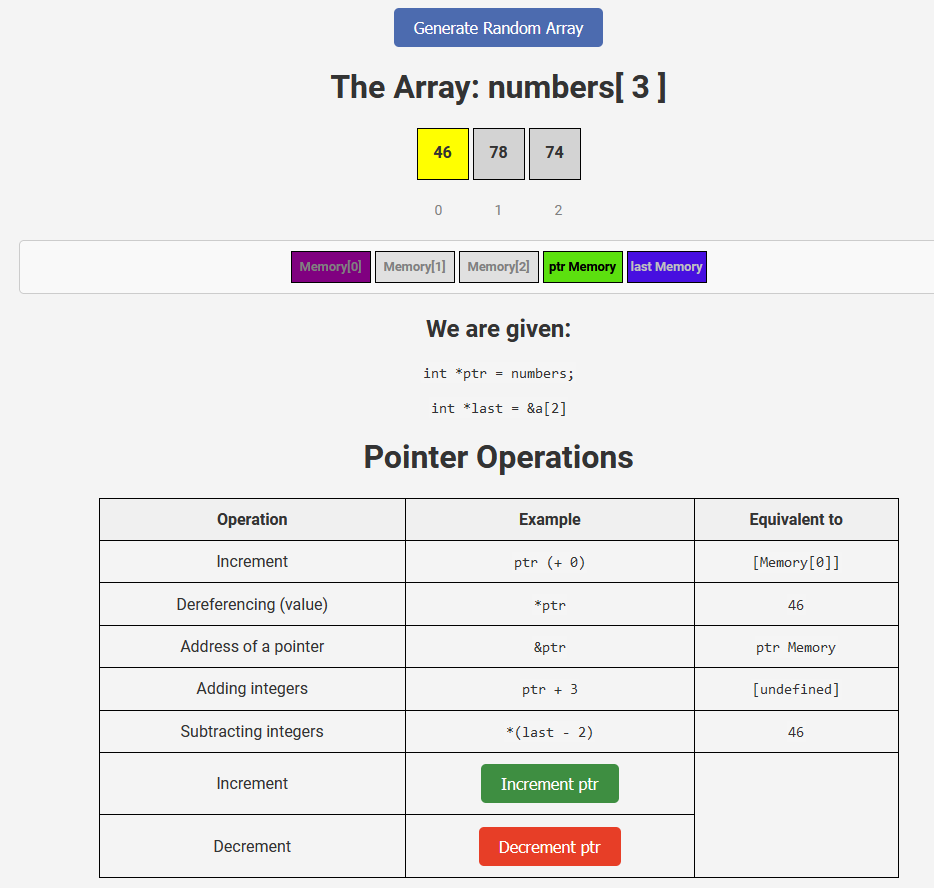

# Pointers in One Dimensional and Two Dimensional Arrays: Understanding Pointers in C

**Author:** [Gabriel Tanase]  
**Date:** [07.12.2024]

## Overview

This web application demonstrates how pointers work with arrays in C.
It visualizes the concepts of pointer operations, including assignment, dereferencing, and incrementing/decrementing.
It offers two main sections: one for exploring pointers in **one-dimensional arrays** and another for **two-dimensional arrays**.

Users can interact with both types of arrays and observe how the pointer's position changes as they increment or decrement it.
The application also provides an easy-to-understand interface with real-time updates on the pointer's movements and memory addresses.

## Screenshoots:

## Features:

- **Random Array Generation**: Generate a random array of numbers in both 1D and 2D formats.
- **Pointer Interaction**: Highlight the pointer in the array and memory block to show how it moves and changes values during pointer operations.
- **Interactive Buttons**: Use **Increment** and **Decrement** buttons to navigate the pointer through the array.
- **Memory Visualization**: Display memory addresses and values in a table, which updates dynamically as the pointer moves.

## Instructions

1. On the main page, select whether you want to explore a **1D array** or a **2D array**.
2. For the **1D array**:
   - Click **"Generate Random Array"** to generate a random array of numbers.
   - The **pointer** (initially at the beginning of the array) is highlighted in **yellow**, and **purple** in the memory block.
   - Use the **Increment** and **Decrement** buttons to move the pointer through the array.
   - The **table** below the array shows examples of pointer operations, with the corresponding values and memory addresses updated.
3. For the **2D array**:
   - The functionality is similar, but now you can interact with a matrix-style array.
   - Use the **Increment** and **Decrement** buttons to navigate across rows and columns.
   - The table will update with memory addresses corresponding to both the row and column positions.

## Technologies Used:

- **HTML**: Structure of the web pages and array layout.
- **CSS**: Styling for the pointer, array, and memory visualization.
- **JavaScript**: Array manipulation, pointer operations, and dynamic updates of values and memory addresses.

## License

This project is open-source and available under the MIT License. See the [LICENSE](LICENSE) file for more information.
